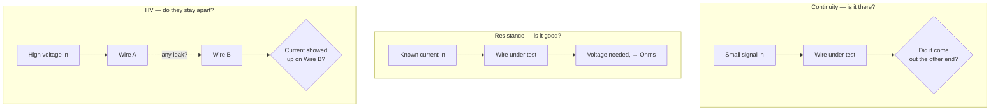
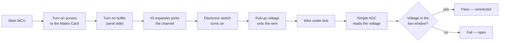
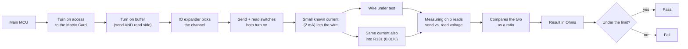
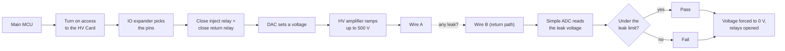

# Test Methods — How Continuity, Resistance, and HV/Insulation Work

Three tests, three different questions, asked through the same harness connector.

**How many wires this covers.** The instrument can reach up to 256 pins on the harness. The Matrix
Card carries all 256 on both sides at once (256 on the "send" side, 256 on the "read" side) — it
handles Continuity and Resistance. HV testing works differently: one HV Card only covers 64 pins
per side (64 for sending high voltage, 64 for reading it back). To reach the same 256 pins the
Matrix Card covers, the instrument stacks 4 HV Cards together — pins 1–64 on the first card, 65–128
on the second, and so on, 4 × 64 = 256.

## 1. The three tests, in simple words

**Continuity — is the wire there at all?**
We send a small signal into one end of the wire and check if it shows up at the other end. If it
does, the wire is connected. If not, the wire is broken or missing. This is a fast yes/no check,
not a precise measurement — it just proves a path exists.

**Resistance — is the wire that's there actually good?**
A wire can be connected but still be bad — thin, corroded, or partly damaged. So we push a small,
known amount of current through the wire and measure how much voltage it takes to push that
current through. A worse wire needs more voltage for the same current. We compare that number
against a limit to decide pass or fail.

**HV / Insulation — do two wires that must stay apart, actually stay apart?**
Some wires must never touch. We put a high voltage (up to 500 V) on one wire and watch whether any
current leaks across to a nearby wire. If current leaks, the gap between them isn't insulating
well enough, and the test fails.

## 2. Continuity — how it really works

The instrument picks the Matrix Card and claims its bus. Since the Matrix Card's chips are split
into two halves, a buffer chip is switched on to reach the correct half — the "send" side, which is
all Continuity needs. An IO expander chip then picks the exact channel, which turns on one small
electronic switch connecting the instrument to the chosen pin.

Once connected, a simple pull-up voltage (a small, fixed voltage through a resistor) is placed on
the send side. If the wire under test is really there, it drags that voltage down to a lower level
at the far end. If the wire is missing or broken, the voltage stays high. A simple ADC chip on the
Control Card reads the voltage and checks which range it falls in: pulled low means the wire is
connected (pass), still high means it's open (fail). There is no comparison against a known
reference here — just a fixed voltage window.

## 3. Resistance — how it really works

Reaching the pin starts the same way as Continuity: claim the Matrix Card's bus, turn on the
buffer, and pick the channel through the IO expander. The difference is that Resistance turns on
**both** halves of the card at once — the "send" side and a separate "read" side, both connected
to the very same pin. This is the "4-wire" idea: the read side carries almost no current, so it
doesn't pick up any extra resistance from the switches themselves, only from the wire.

The measuring chip pushes a small, known current (2 mA) straight into the wire using a current
source built into itself — no separate driver chip is needed. It then reads the voltage between
the two "read" taps. A bigger voltage for the same current means a worse (higher-resistance) wire.

Before trusting that number, three things happen to make it accurate:

1. **Offset removal.** The same reading is taken again with the current switched off, and that
   baseline is subtracted — this removes small unwanted voltages picked up from the switches
   themselves, not just from the measuring chip.
2. **Comparison against a known-good resistor.** The same current that flows through the wire also
   flows through a very accurate resistor built into the board (R131, accurate to 0.01%). The
   instrument reads both and works out a ratio. This matters because the current source by itself
   can be off by a few percent — comparing against R131 instead means the result depends on R131's
   accuracy, not the current source's.
3. **One-time self-check.** When the instrument first powers on, the measuring chip checks and
   cancels its own small internal error, once, before any wire is ever tested.

The final number, in ohms, is compared against a limit to decide pass or fail. The GUI can ask the
instrument what calibration it's using with a command called `CAL GET`.

## 4. HV / Insulation — how it really works

This test uses a different card entirely — the HV Card, not the Matrix Card — so there's no buffer
step; the HV Card's chips aren't split into two halves. The instrument claims the HV Card's bus,
then talks to an IO expander that closes two small relays (real mechanical switches, not
electronic ones): one on the wire being pushed with high voltage, and one on the wire being
checked for leakage. These relays are only closed while the line is confirmed to be at 0 V, for
safety.

Once both relays are closed, a small DAC chip sets a voltage level, which drives a high-voltage
amplifier that ramps the real test voltage up — as high as 500 V DC — onto the first wire. After a
short pause to let the voltage settle, a second simple ADC chip reads the voltage on the second
wire's return path. If the insulation between the two wires is good, almost nothing shows up here.
If it's damaged or too close together, some current leaks across and shows up as a small voltage.

There is no comparison against a known reference for this test — the reading is just checked
against a small, fixed limit: under the limit is a pass, over it is a fail. As soon as the test
ends (pass, fail, or abort), the instrument always drives the voltage back to 0 V and discharges
the line before opening the relays.

